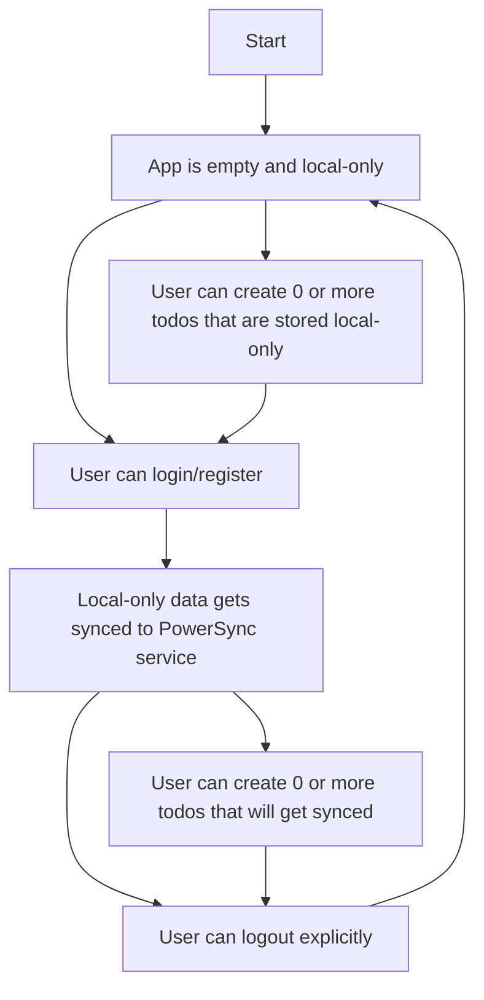

# PowerSync + Supabase Flutter Local Only to Online Mode Demo: Todo List App

This demo app is an extension of the Flutter Todo List App that demonstrates how to use the PowerSync SDK for Flutter in an local only way. It allows the user to use the app offline without having to sign in. After signing in data that was kept locally is synced up. For a step-by-step guide, see [here](https://docs.powersync.com/integration-guides/supabase).

# Running the app

Ensure you have [melos](https://melos.invertase.dev/~melos-latest/getting-started) installed.

1. `cd demos/local-only-todolist`
2. `melos prepare`
3. `cp lib/app_config_template.dart lib/app_config.dart`
4. Insert your Supabase and PowerSync project credentials into `lib/app_config.dart` (See instructions below)
5. `flutter run`

# Set up Supabase Project

Create a new Supabase project, and paste an run the contents of [database.sql](./database.sql) in the Supabase SQL editor.

It does the following:

1. Create `lists` and `todos` tables.
2. Create a publication called `powersync` for `lists` and `todos`.
3. Enable row level security, allowing users to only view and edit their own data.
4. Create a trigger to populate some sample data when an user registers.

# Set up PowerSync Instance

Create a new PowerSync instance, connecting to the database of the Supabase project.

Then deploy the following sync rules:

```yaml
bucket_definitions:
  user_lists:
    # Separate bucket per todo list
    parameters: select id as list_id from lists where owner_id = token_parameters.user_id
    data:
      - select * from lists where id = bucket.list_id
      - select * from todos where list_id = bucket.list_id
```

# Configure the app

Insert the credentials of your new Supabase and PowerSync projects into `lib/app_config.dart`

# Explanation

The demo implements local-only and synced modes by using two sets of schema definitions, which can be viewed [here](./lib/models/schema.dart). The app initially starts in local only mode with the offline schema. When the user signs in, the database schema is updated to the online schema, and the data is migrated to enable synchronization.

After this point, being signed in no longer determines which schema should be used, as the user's session expiring and explicitly signing out trigger different behaviors. If the session expires, the user can continue interacting with their data. However, if the user explicitly logs out, all data is cleared, effectively resetting the app. To manage this, an additional local storage mechanism is used to track which schema is currently in use, as seen [here](./lib/models/sync_mode.dart.dart). Note that any other local storage solution would work as long as it's not using the PowerSync database (chicken and egg problem).

## Flow chart



## Limitations

`updateSchema` cannot be called inside a transaction, and it's recommended to perform the schema update when the database isn't connected.
Additionally, the current implementation of the PowerSync SDK's `watch` method may not correctly track tables that are altered by `updateSchema`. As a result, you will likely need to refresh your `watch` calls after the schema update is complete. In this demo, the `watch` calls are refreshed by navigating to the login and signup pages after the user successfully logs in and the schema update is finished.
