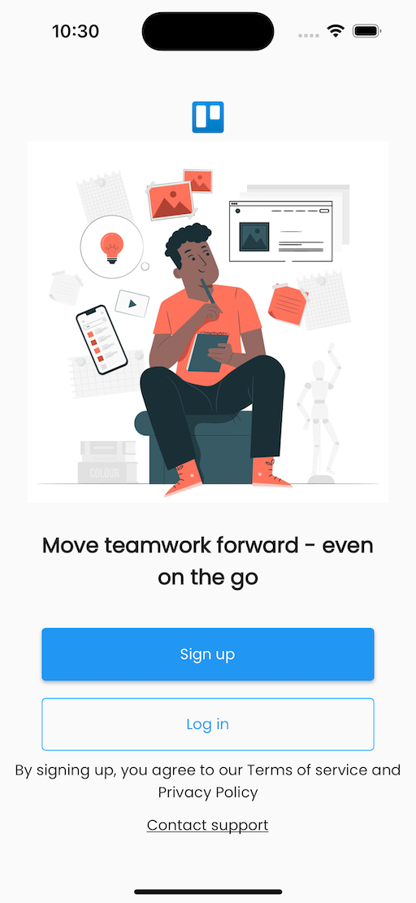
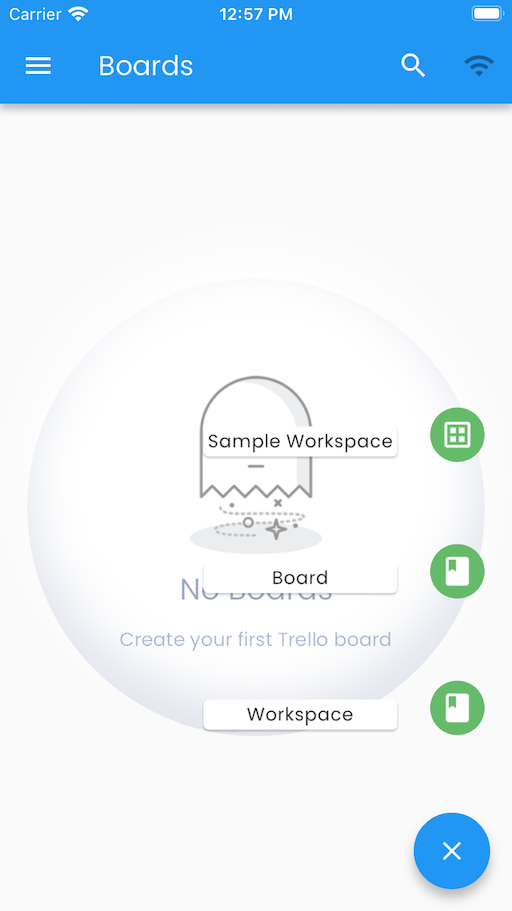

# Trello Clone Using PowerSync + Flutter

## Introduction

Trello clone app built with [Flutter](https://flutter.dev/), [PowerSync](https://powersync.co/) and [Supabase](https://supabase.io/)



# Running the app

Ensure you have [melos](https://melos.invertase.dev/~melos-latest/getting-started) installed.

1. `cd demos/supabase-trello`
2. `melos prepare`
3. `cp .env.template .env`
4. Insert your Supabase and PowerSync project credentials into `.env` (See instructions below)
5. `flutter run`

# Getting Started

First check out [the integration guide](https://docs.powersync.co/integration-guides/supabase-+-powersync) for [PowerSync](https://powersync.co/) and [Supabase](https://supabase.io/).

Before you proceed, we assume that you have already signed up for free accounts with both Supabase and PowerSync. If you haven't signed up for a **PowerSync account** yet, [click here](https://accounts.journeyapps.com/portal/free-trial?powersync=true) (and if you haven't signed up for **Supabase** yet, [click here](https://supabase.com/dashboard/sign-up)). We also assume that you already have Flutter set up.

Next up we will follow these steps:

1. Configure Supabase:
    - Create the database schema
    - Create the Postgres publication
2. Configure PowerSync:
    - Create connection to Supabase
    - Configure global Sync Rules
4. Configure the Trello clone app
5. Run the app and test
6. Configure improved Sync Rules
7. Run the app and test

## Configure Supabase

- Create a new Supabase project (or use an existing project if you prefer) and follow the below steps.
- For ease of use of this Flutter app, you can **disable email confirmation** in your Supabase Auth settings. In your Supabase project, go to _"Authentication"_ --> _"Providers"_ -> _"Email"_ and then disable _"Confirm email"_. If you keep email confirmation enabled, the Supabase user confirmation email will reference the default Supabase Site URL of http://localhost:3000 — you can ignore this.

### Create the Database Schema
After creating the Supabase project, we still need to create the tables in the database. For this application we need the following tables:

* `activity`
* `attachment`
* `board`
* `card`
* `checklist`
* `comment`
* `listboard`
* `member`
* `models`
* `trellouser`
* `workspace`
* `board_label`
* `card_label`

_(We give a brief overview of the app domain model later in this README.)_

Do the following:
- Open the `tables.sql` file, and copy the contents.
- Paste this into the *Supabase SQL Editor*
- Run the SQL statements in the Supabase SQL Editor. (If you get a warning about a "potentially destructive operation", that's a false positive that you can safely ignore.)

### Create the Postgres Publication

PowerSync uses the Postgres [Write Ahead Log (WAL)](https://www.postgresql.org/docs/current/wal-intro.html) to replicate data changes in order to keep PowerSync SDK clients up to date. To enable this we need to create a `publication` in Supabase.

Run the below SQL statement in your Supabase SQL Editor:
```sql
create publication powersync for table activity, attachment, board, card, checklist, comment, listboard, member, trellouser, workspace, board_label, card_label;
```

## Configuring PowerSync

We need to connect PowerSync to the Supabase Postgres database:

- In the [PowerSync dashboard](https://powersync.journeyapps.com/) project tree, click on _"Create new instance"_.

- Give your instance a name, such as _"Trello Clone"_.

- In the _"Edit Instance"_ dialog, navigate to the _"Credentials"_ tab and enable _"Use Supabase Auth"_.

- Under the _"Connections"_ tab, click on the + icon.

- On the subsequent screen, we'll configure the connection to Supabase. This is simplest using your Supabase database URI. In your Supabase dashboard, navigate to _"Project Settings"_ -> _"Database"_. Then, under the _"Connection String"_ section, switch to URI and copy the value.

- Paste the copied value into the _"URI"_ field in PowerSync.

- Enter the Password for the `postgres` user in your Supabase database. (Supabase also [refers to this password](https://supabase.com/docs/guides/database/managing-passwords) as the database password or project password)

- Click _"Test Connection"_ and fix any errors.

- Click "Save"

PowerSync deploys and configures an isolated cloud environment for you, which will take a few minutes to complete.


## Configuring Sync Rules - 1

PowerSync [Sync Rules](https://docs.powersync.co/usage/sync-rules) allow developers to control which data gets synced to which user devices using a SQL-like syntax in a YAML file.  For this Trello clone demo app, we're first going to use naive global sync rules, and then present improved rules that take the domain permissions into account.


### Global Sync Rules to Get Things Working

We can be naive about it, and start by using a global bucket definition that at least specifies in some way which users can get data.

- Copy the contents of `sync-rules-0.yaml` to `sync-rules.yaml` under your PowerSync project instance.
- In the top right of the `sync-rules.yaml` editor, click _"Deploy sync rules"_.
- Confirm in the dialog and wait a couple of minutes for the deployment to complete.

When you now run the app (after completing the next step to configure and run the app), it will actually show and retain data. The app code itself applies some basic filtering to only show data that belongs to the current user, or according to the visibility and membership settings of the various workspaces and boards.


## Configuring Flutter App

We need to configure the app to use the correct PowerSync and Supabase projects.

- Copy the `trelloappclone_flutter/.env.template` file to `trelloappclone_flutter/.env`.
- Replace the values for `SUPABASE_URL` and `SUPABASE_ANON_KEY` (You can find these under _"Project Settings"_ -> _"API"_ in your Supabase dashboard — under the _"URL"_ section, and anon key under _"Project API keys"_.)
- For the value of `POWERSYNC_URL`, follow these steps:
   1. In the project tree on the PowerSync dashboard, right-click on the instance you created earlier.
   2. Click _"Edit instance"_.
   3. Click on _"Instance URL"_ to copy the value.


## Build & Run the Flutter App

- Run ``` flutter pub get ``` to install the necessary packages (in the root directory of the project.)
- Invoke the ``` flutter run ``` command, and select either an Android device/emulator or iOS device/simulator as destination (_Note: PowerSync does not support Flutter web apps yet._)


## Configuring Sync Rules - 2

### Using Sync Rules to Enforce Permissions
We have syncing working, but the sync rules are not enforcing the access rules from the domain in any way.

It is better that we do not sync data to the client that the logged-in user is not allowed to see. We can use PowerSync sync rules to enforce permissions, so that users can only see and edit data that they are allowed to see and edit.

First, we need to understand the permissions from the app domain model:

- A **workspace** is created by a user — this user can always see and edit the workspace.
- A **workspace** has a specific *visibility*: private (only the owner can see it), workspace (only owner and members can see it), or public (anyone can see it).
- A **workspace** has a list of *members* (users) that can see and edit the workspace, if the workspace is not private.
- A **board** is created by a user — this user can always see and edit the board as long as the user can still access that workspace
- A **board** has a specific *visibility*: private (only the owner can see it), workspace (only owner and members belonging to the parent workspace can see it)
- A user can see (and edit) any of the **cards** and **lists** belonging to a **board** that they have access to.
- A user can see (and edit) any of the **checklists**, **comments**, and **attachments** belonging to a **card** that they have access to.

Also have a look at `trelloappclone_flutter/lib/utils/service.dart` for the access patterns used by the app code.

Let's explore how we can use PowerSync Sync Rules to enforce these permissions and access patterns.

First we want to sync the relevant `trellouser` records synced to the local database. To enable lookups of users for adding as members to workspaces, we currently sync all user records. For a production app, we would ideally work via an API to invite members, and not worry about direct data lookups on the app side.

```yaml
bucket_definitions:
  user_info:
    # this allows syncing of all trellouser records so we can lookup users when adding members
    data:
      - SELECT * FROM trellouser
```

Then we want to look up all the workspaces (a) owned by this user, (b) where this user is a member, or (c) which are public.

```yaml
  by_workspace:
    # the entities are filtered by workspaceId, thus linked to the workspaces (a) owned by this user, (b) where this user is a member, or (c) which are public
    # Note: the quotes for "workspaceId" and "userId" is important, since otherwise Postgres does not deal well with non-lowercase identifiers
    parameters:
      - SELECT id as workspace_id FROM workspace WHERE
        workspace."userId" = token_parameters.user_id
      - SELECT "workspaceId" as workspace_id FROM member WHERE
        member."userId" = token_parameters.user_id
      - SELECT id as workspace_id FROM workspace WHERE
        visibility = "Public"
    data:
      - SELECT * FROM workspace WHERE workspace.id = bucket.workspace_id
      - SELECT * FROM board WHERE board."workspaceId" = bucket.workspace_id
      - SELECT * FROM member WHERE member."workspaceId" = bucket.workspace_id
      - SELECT * FROM listboard WHERE listboard."workspaceId" = bucket.workspace_id
      - SELECT * FROM card WHERE card."workspaceId" = bucket.workspace_id
      - SELECT * FROM checklist WHERE checklist."workspaceId" = bucket.workspace_id
      - SELECT * FROM activity WHERE activity."workspaceId" = bucket.workspace_id
      - SELECT * FROM comment WHERE comment."workspaceId" = bucket.workspace_id
      - SELECT * FROM attachment WHERE attachment."workspaceId" = bucket.workspace_id
      - SELECT * FROM board_label WHERE board_label."workspaceId" = bucket.workspace_id
      - SELECT * FROM card_label WHERE card_label."workspaceId" = bucket.workspace_id
```

**To Configure the Improved Sync Rules, Follow These Steps:**

- Copy the contents of `sync-rules-1.yaml`.
- Paste this to `sync-rules.yaml` under your PowerSync project instance
- Click _"Deploy sync rules"_.
- Confirm in the dialog and wait a couple of minutes for the deployment to complete.

Now you can run the app again, and it should now only sync the subset of data that a logged in user actually has access to.

### Importing / Generating Data

When you run the app, after logging in, you will start without any workspaces or boards. It is possible to generate a workspace with sample boards and cards in order to make it easier to have enough data to experiment with, without having to manually create every item.

- Sign up and log in to the app.
- In the home view, tap on the "+" floating button in the lower right corner.
- Tap on _"Sample Workspace"_ and give it a name — this will create a new workspace, with multiple boards with lists, and a random number of cards with checklists, comments and activities for each list.



### Structure

* The data models are in `lib/models`)
* A PowerSync client that makes use of the PowerSync Flutter SDK and adds a few convenience methods for the app use cases (`lib/protocol/powersync.dart`)
* A `DataClient` API that can be used from the app code, and provides the higher level data API. (`lib/protocol/data_client.dart`)

Two important files to point out as well are:

* `lib/schema.dart` defines the SQLite schema to use for the local synced datastore, and this maps to the model classes.
* `lib/app_config.dart` contains the tokens and URLs needed to connect to PowerSync and Supabase.


### Listening to Updated Data

The PowerSync SDK makes use of `watch` queries to listen for changes to synced data. When the SDK syncs updated data from the server, and it matches the query, it will send an event out, allowing e.g. an app view (via `StreamBuilder`) or some other state management class to respond.

As an example look at `trelloappclone_flutter/lib/utils/service.dart`:

```dart
  Stream<List<Workspace>> getWorkspacesStream() {
    return dataClient.workspace.watchWorkspacesByUser(userId: trello.user.id).map((workspaces) {
      trello.setWorkspaces(workspaces);
      return workspaces;
    });
  }
```

This in turn makes use of the `_WorkspaceRepository` class:
```dart
  Stream<List<Workspace>> watchWorkspacesByUser({required String userId}) {
    //First we get the workspaces
    return client.getDBExecutor().watch('''
          SELECT * FROM workspace WHERE userId = ?
           ''', parameters: [userId]).asyncMap((event) async {
      List<Workspace> workspaces = event.map((row) => Workspace.fromRow(row)).toList();

      //Then we get the members for each workspace
      for (Workspace workspace in workspaces) {
        List<Member> members = await client.member.getMembersByWorkspace(workspaceId: workspace.id);
        workspace.members = members;
      }
      return workspaces;
    });
  }
```

Now we can simply make use of a `StreamBuilder` to have a view component that updates whenever a matching workspace is updated:

```dart
      StreamBuilder(
          stream: getWorkspacesStream(),
          builder:
              (BuildContext context, AsyncSnapshot<List<Workspace>> snapshot) {
            if (snapshot.hasData) {
              List<Workspace> children = snapshot.data as List<Workspace>;

              if (children.isNotEmpty) {
                return SingleChildScrollView(
                    child:
                        Column(children: buildWorkspacesAndBoards(children)));
              }
            } else {
              return Container();
            }
          })
```

### Doing a Transaction

It is possible to ensure that a number of related entities are updated in an atomic database transaction. As an example of this, look at `DataClient.archiveCardsInList`:

```dart
  /// Archive cards in and return how many were archived
  /// This happens in a transaction
  Future<int> archiveCardsInList(Listboard list) async {
    if (list.cards == null || list.cards!.isEmpty) {
      return 0;
    }

    //start a write transaction
    return client.getDBExecutor().writeTransaction((sqlContext) async {
      List<Cardlist> cards = list.cards!;
      int numCards = cards.length;

      //we set each of the cards in the list to archived = true
      sqlContext.executeBatch('''
          UPDATE card
                  SET archived = 1
                  WHERE id = ?
          '''
      , cards.map((card) => [card.id]).toList());

      //touch listboard to trigger update via stream listeners on Listboard
      sqlContext.execute('''
          UPDATE listboard
                  SET archived = 0
                  WHERE id = ?
          ''', [list.id]);

      list.cards = [];
      return numCards;
      //end of transaction
    }, debugContext: 'archiveCardsInList');
  }
```

The above code is invoked if you choose to archive all the cards in a list from the list popup menu.

### Changes from Original Trello Clone App

The app code was forked from the [Serverpod + Flutter Tutorial](https://github.com/Mobterest/serverpod_flutter_tutorial) code. It was changed in the following ways to facilitate the PowerSync integration:

- Updated data model so that all `id` fields are Strings, and use UUIDs (it was auto-increment integer fields in the original app)
- Updated data model so that all entities refer to the `workspaceId` of workspace in which it was created (this facilitates the Sync Rules)

## Next

Below is a list of things that can be implemented to enhance the functionality and experience of this app:

* Update Workspace + Board edit views to use actual data and update the entity
* Get Comments & Checklists working properly
* Enhance state management - e.g. let `TrelloProvider` listen to streams, and notify changes, to simplify views
* Get the attachments to actually work (using Supabase files upload/download)

## Feedback

- Feel free to send feedback. Feature requests are always welcome. If there's anything you'd like to chat about, please [join our Discord](https://discord.gg/powersync).

## Acknowledgements

This tutorial is based on the [Serverpod + Flutter Tutorial](https://github.com/Mobterest/serverpod_flutter_tutorial) by [Mobterest](https://www.instagram.com/mobterest/)
